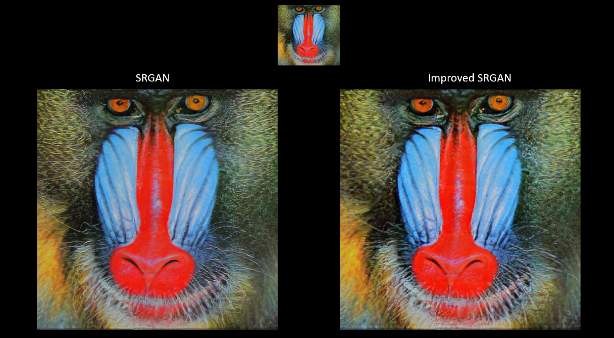

## GNR 638 Course Project: Neural Super Sampling

We run this script under [TensorFlow](https://www.tensorflow.org) 2.0.

- In this project we attempt to upscale an image by a factor of 4 times
- This repo consists of two approches: **SRGAN** and **Improved SRGAN (ESRGAN)**

## SRGAN Architecture

Our COLAB Implementation can be found here: https://github.com/invisibleflame/Neural_super_sampling/blob/master/SRGAN/SRGan.ipynb

<a href="https://www.google.com/url?sa=i&url=https%3A%2F%2Fidealo.github.io%2Fimage-super-resolution%2F&psig=AOvVaw2ydkDLgHWR3TYphMGePTLs&ust=1637470615245000&source=images&cd=vfe&ved=0CAsQjRxqFwoTCKio18mTpvQCFQAAAAAdAAAAABAD">

	

</a>

### Results:

<a>

	

</a>

<a>

	

</a>

### Training Details:
- Training dataset consists of 8144 images. Low Resolution images created by resizing the HR images
- Num of Epochs = 1000
- Loss function: Binary Cross Entropy
- Optimizer: rmsprop

## ESRGAN Architecture

Our COLAB Implementation can be found here: https://github.com/invisibleflame/Neural_super_sampling/blob/master/Improved%20SRGAN%20(ESRGAN)/Improve_SRGAN.ipynb

<a href="https://miro.medium.com/max/855/1*eFtiKIAtigow1OQGrhkWSA.png">

	

</a>

### Results (improvement over SRGAN):
<a>

	

</a>

### Training Details:
- Training dataset consists of 8144 images. Low Resolution images created by resizing the HR images
- Num of Epochs = 2200
- Loss function: Binary Cross Entropy
- Optimizer: rmsprop

# RUN
- Upload your Low resolution image in `SRGAN/test/input` and high resolution output will be generated in `SRGAN/test/output` (similar procedure goes for ESRGAN)
- Start training: `python train.py`
- For testing: `python test.py`
- `model.py` consists of the SRGAN model code

# References:
SRGAN:	https://arxiv.org/abs/1609.04802 \
ESRGAN:	https://arxiv.org/abs/1809.00219

# Contributors:
- Bhuvan Aggarwal	(190040026)
- Punit Madia		(190100096)
- N. V. Sai Gangadhar	(190100080)

								        Made with 💙
